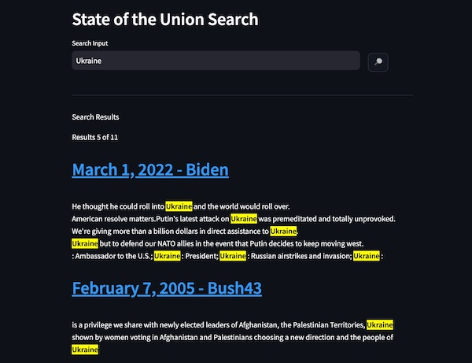
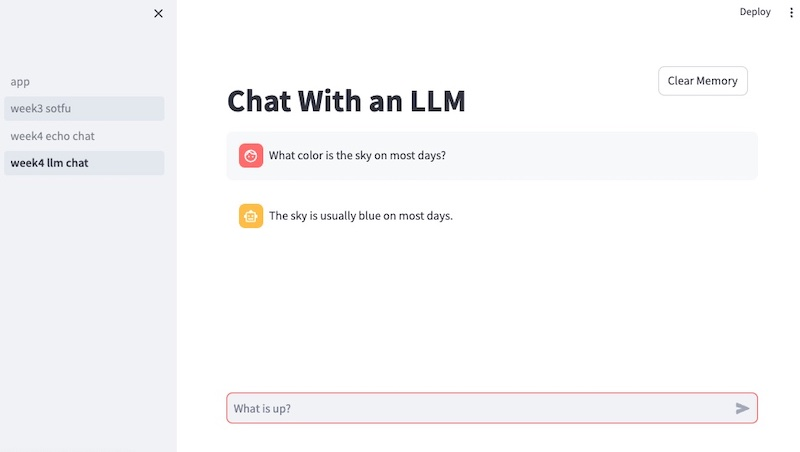

# GenAI Search Study Group

## Week by Week Materials

* [Week 1](class/week01/README.md) - Environment Setup
* [Week 2](class/week02/README.md) - Elasticsearch Python
* [Week 3](class/week03/README.md) - Streamlit
* [Week 4](class/week04/README.md) - Connecting to LLMs
* Week 5 - Ingest Processors and NER
* Week 6 - Chunking and Vector Embeddings
* Week 7 - Vector Search and Subdocument Hits
* Week 8 - RAG in Streamlit

# Pics of what we'll build

Week2


Week3


Week4



## Objective

The goal here is to help you learn just enough to be able to rapid prototype using Search and AI.

While it has never been easier to learn search and AI, it's hard to know where to start.  Equally, Javascript and building user interfaces have sadly turned into specialist skills.

[Youtube - Should you Learn Javascript?](https://www.youtube.com/watch?v=Uo3cL4nrGOk)

So we are going to learn using Python and StreamLit. What we make won't be production quality ... but we will get ourselves Proof of Concept capable.

The goal of this repo is to make weekly content to help get a curious engineer or software architect **hands-on**. We'll do weekly self-paced exercises and goals to get up to speed using Elastic, Python, and newer technology like semantic search and Large Language Models

We won't teach Python here, but we'll take things slowly and keep it as simple as possible so those new to Python don't get left behind. 


## Directory structure

```txt
/
/ class  -- clean examples, week by week
/ class/week01 - self-contained resources and guides for this week's learning
```

