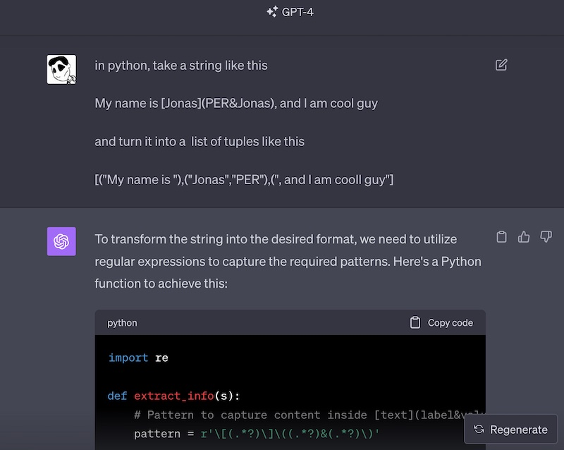
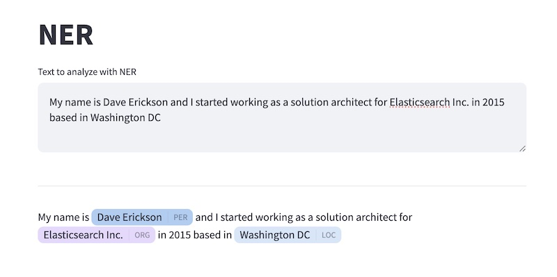

# Week 5

## Learning Objectives

* Ingest Processors
* Hosting Pytorch Models in Elasticsearch
* NER - and how Natural Language Processing isn't perfect
* Ingest Processors on dirty structured data
* Reindexing the State of the Union with hosted NER

## Step 1 - Pipelines and Processors

To create vector embeddings and work ELSER we are going to have to become comfortable with Elasticsearch Ingest Pipelines and Ingest Processors.

copy cover the ```.env``` from week4

```bash
## from the week05 folder
cp ../week04/.env .env
```

Assuming you already have the username and password from week 2, add the following to your .env file for your Elasticsearch server.  It should be something like this

```bash
ELASTIC_DOMAIN="subdomain.gcp.cloud.es.io"
ELASTIC_PORT="443"
ELASTIC_PROTOCOL="https"
```

Let's learn about Named Entity Recognition by running through the following notebook:

[NER Notebook](NamedEntityRecognition.ipynb) <--  run this

>  ❓ Why are we learning this? ... NER is a good example of a model we can run inside Elasticsearch to enrich data for Search Apps

## Step 2 - Use NER in Streamlit

we are going to use a community extension for streamlit that does a great job of highlighting annotated entities

[https://github.com/tvst/st-annotated-text](https://github.com/tvst/st-annotated-text)

```bash
## from the week05 folder
pip install st-annotated-text
cp -R ../week04/app app 
cd app
rm -rf __pycache__
streamlit run app.py
```

Let's make a simple streamlit app that exercises the deployed NER model

add a new file ```app/pages/week5_ner.py```

Here is a stub for the code

```python
import streamlit as st
from annotated_text import annotated_text
from resources import get_es

import re

def annotated_entity_to_list_of_tuples(message_ner):
    ## TODO replace with actual regular expressions that parse the 
    ## NER annotated text in message_ner into a list of tuples
        # result = [
        #     ("Todo this is text. A "),
        #     ("Named", "Person"),
        #     (" is identified")
        # ]

    result = (message_ner)

    return message_ner

def process_ner(text_input):
    es = get_es()

    docs = [{ "_source": {"message": text_input}}]
    infrence = es.ingest.simulate(id='week5_ner', docs=docs)
    message_ner = infrence["docs"][0]["doc"]["_source"]["message_ner"]

    list_of_results = annotated_entity_to_list_of_tuples(message_ner)
    return list_of_results


"# Named Entity Recognition"

text_area = st.text_area("Text to analyze with NER")

if text_area:
    st.divider()
    processed_text = process_ner(text_area)
    annotated_text(processed_text)
```

Remember, there is no shame in just asking ChatGPT how to do some of the complex tasks of coding. Regular expressions are only fun for some people (not me)



Refer to the documentation for the annotated_text widget and process the text as enriched by that NER model in Elasticsearch


Here'e what I asked ChatGPT-4
```txt
in python, take a string like this

My name is [Jonas](PER&Jonas), and I am cool guy

and turn it into a  list of tuples like this

[("My name is "),("Jonas","PER"),(", and I am cool guy"]
```

It makes python code that is almost perfect. Try to write the code by yourself or using ChatGPT.  If you get stuck (or don't have access to GPT-4, which does better than GPT-3) the answer is in ```answer.py```


### Side Note - Recognition vs Resolution

Now here's the bad news.  **Named Entity Recognition** is an error-prone process. False positives are very likely and tuning out false positives is an advanced skill.  Additionally, just knowing something is a person or an organization is not as useful as knowing which unique person correlated across records and data sets. Determining which unique entity in a master dictionary of entities is called **Named Entity Resolution**, and this is harder.

## Step 3 - Using Reindex

Reindexing data is an important part of developing apps. Often you'll have the pre-enriched data in a staging index and need to add things to it as you go.  Getting the error logs out of Ingest Pipelines is much harder than doing local ETL, but Ingest Pipelines scale as you add Elasticsearch nodes ... so there is a big Operational advantage when it is time to put them in production.

Run through this Python notebook to do some reindexing AND run NER over the State of the Union Address index.

[Reindexing with Ingest Pipelines](ReindexingWithPipelines.ipynb)

## Step 4 - Reindex your State of the Union Data with NER

Step through the following to add ner_text and facets_* fields

[Reindex SOTU NER](ReindexSOTU_NER.ipynb) <-- run this 

## Step 5 - Modify the facets app to target the new index

Let's make a copy of the app from week 3 to add facets for the NER fields

```bash
## from the week05 folder
cd app
cp week3_sotfu.py week5_sotfu.py
streamlit run app.py
```

* Change the index being accessed to ```genai_state_of_the_union_ner```
* add aggs for the new NER-based fields.  make sure the agg buckets are named <field>_facets

```python
    aggs = {
        "administration_facets": {
            "terms": {
                "field": "administration" 
            }
        },
        "person_facets": {
            "terms": {
                "field": "person" ,
                "size": 5,
            }
        },
        "organization_facets": {
            "terms": {
                "field": "organization"  ,
                "size": 5,
            }
        },
        "misc_facets": {
            "terms": {
                "field": "misc"  ,
                "size": 5,
            }
        },
        "location_facets": {
            "terms": {
                "field": "location"  ,
                "size": 5,
            }
        }
    }
```

* change the default field for the text searching to the text field   ```"default_field": "text"``
* There was a small bug in the facet rendering code from week 3.  The initialization of ```change_detected``` was inside the key for-loop when it should have been outside.  Make sure the facet rendering code looks like this.  Depending on when you did week 3, this may not be a change.

```python
    with r1:
        aggs = st.session_state.search_aggs if "search_aggs" in st.session_state else {}
        change_detected = False
        for key in aggs:
            field_name = key.replace("_facets","")
            f"#### {field_name}"
            for bucket in aggs[key]["buckets"]:
                facet_value = bucket['key']
                doc_count = bucket['doc_count']
                facet_index = f"{field_name}|{facet_value}"
                
                ## the checkbox
                checkbox = st.checkbox(f"{facet_value} ({doc_count})", key=facet_index)
                ## grab the current value from session state so we can detect change
                cur_val = facet_index in st.session_state.facet_selections and st.session_state.facet_selections[facet_index] 
                ## Based on the value, which may include the user just having changed it, set state and detect change
                if checkbox:
                    st.session_state.facet_selections[facet_index] = True
                    if not cur_val:
                        change_detected = True
                else:
                    st.session_state.facet_selections[facet_index] = False
                    if cur_val:
                        change_detected = True

        if change_detected:            
            runKeywordSearch(keyword_search_box)
            st.rerun()
```

The NER model truncates the text that it uses, only analyzing the first chunk of text. Looking through the value you'll see how important Resolution is for getting cleaner distinct entity values.


if you get stuck, the code for a working week5_sotu.py is in the file ```week5_answer.py``` 


